# **Project 2 - ZETA: Network sniffer**

## **Usage**
`Usage: './ipk-sniffer [-i interface | --interface interface] {-p port [--tcp|-t] [--udp|-u]} [--arp] [--icmp4] [--icmp6] [--igmp] [--mld] {-n num}'`
List of iterfaces can be found by running `ipk-sniffer -i` or `ipk-sniffer --interfaces` or 
just `ipk-sniffer`, then you will just choose interface from the list and
run it with optional arguments.(for example: `./ipk-sniffer -i eth0 -p 80 --tcp`)

# **Options:**
- `-i interface` or `--interface interface` - interface to sniff on
- `-p port` - port to filter
- `--tcp` or `-t` - filter for TCP packets
- `--udp` or `-u` - filter for UDP packets
- `--arp` - filter for ARP packets
- `--icmp4` - filter for ICMPv4 packets
- `--icmp6` - filter for ICMPv6 packets
- `--igmp` - filter for IGMP packets
- `--mld` - filter for MLD packets
- `--ndp` - filter for NDP packets
- `-n num` - number of packets to capture


# **Code description**
The ipk-sniffer program is used to capture and display network traffic on a specified network interface. Firstly the ipk-sniffer parses arguments (`getopt_long()`) and checks all errors that can occur. If none arguments are passed then all are activated. If we ran program without argumets or with specific `-i`, then all available interfaces will be displayed from which we can choose. For next section pcap library is needed. Firstly we use `pcap_lookupnet()` to retrieve the IP address and netmask of the network interface specified by the user. Then we use `pcap_open_live()` to open the specified interface for capturing packets. `pcap_datalink()`  checks that the data link type of the interface is Ethernet. Then we set a filter for the captured packets based on user-specified criteria using `pcap_compile()` and `pcap_setfilter()`. String which we want to filter is being made manualy in funcion `fetch_filter()`. `MLD` and `NDP` are node discovery protocols based on `ICMPv6`. Thats why there are filtered using `icmpv6`. `TCP` and `UDP` are only protocols using port, if another protocol uses port, port will be ignored. After that we can start capturing packets using `pcap_loop()`, with a user specified (`-n`) maximum number of packets to capture and a callback function (`packet_sniffer()`) to handle each packet. In the callback we set a signal handler for the SIGINT signal and we set the timestamp and print it. Then we check ethernet header and decide it's type, whether it is `IPv4`, `IPv6`, or `ARP`. **IPv6**: Internet Protocol version 6 is the most recent version of the Internet Protocol, the communications protocol that provides an identification and location system for computers on networks and routes traffic across the Internet. **IPv4**: Internet Protocol version 4 is the fourth version of the Internet Protocol. It is one of the core protocols of standards-based internetworking methods in the Internet and other packet-switched networks. **ARP**: The Address Resolution Protocol is a communication protocol used for discovering the link layer address, such as a MAC address, associated with a given internet layer address, typically an IPv4 address. This is achived by determining `EtherType`. EtherType is a two-octet field in an Ethernet frame. It is used to indicate which protocol is encapsulated in the payload of the frame and is used at the receiving end by the data link layer to determine how the payload is processed. There we set `ip` or `ip6` to point to the `IPv4` or `IPv6` header and we calculate it's size. It uses inet_ntop() to convert the source and destination IP addresses to strings and stores them in ip_src and ip_dst. It prints the source and destination MAC addresses, the frame length, and the source and destination IP addresses to the `stdout`. If the packet is an `IPv6` packet, it sets bool is_ipv6 to `true` and same for `IPv4`. Protocol for `IPv4` can be found in `ip->ip_p` and for `IPv6` we use `ip6->ip6_nxt`. By this and by before set bool we can properly find protocol and display it's packet in `hex` and `ascii` format using `data_print()` function . In program `ICMP`, `ICMPv6`, `IGMP` protocols in switch, are repetitive for optional enhancing of program for future. After all packets are captured, we close the interface using `pcap_close()` and exit the program.

## **Tests**
- for testing, I used 'wireshark' and 'tcpreplay'.
- `tcpreplay` allowed me to send packets to the interface and then I could see the output of the program. (but I didn't find NDP and MLD packets so those are not tested)
- all of those tests match with wiresharks output

### **Test 1 - tcp IPv4**
#### **wireshark**
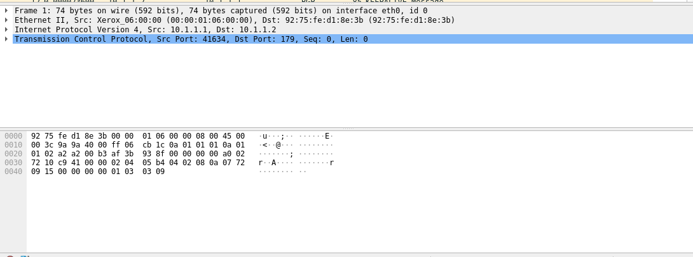

```
0000   92 75 fe d1 8e 3b 00 00 01 06 00 00 08 00 45 00   .u...;........E.
0010   00 3c 9a 9a 40 00 ff 06 cb 1c 0a 01 01 01 0a 01   .<..@...........
0020   01 02 a2 a2 00 b3 af 3b 93 8f 00 00 00 00 a0 02   .......;........
0030   72 10 c9 41 00 00 02 04 05 b4 04 02 08 0a 07 72   r..A...........r
0040   09 15 00 00 00 00 01 03 03 09                     ..........
```
#### **ipk-sniffer**
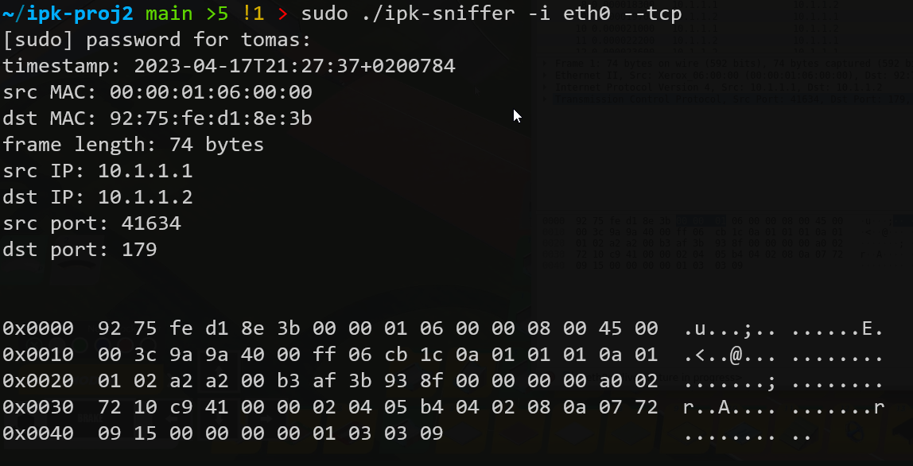

```
0x0000  92 75 fe d1 8e 3b 00 00 01 06 00 00 08 00 45 00  .u...;.. ......E.
0x0010  00 3c 9a 9a 40 00 ff 06 cb 1c 0a 01 01 01 0a 01  .<..@... ........
0x0020  01 02 a2 a2 00 b3 af 3b 93 8f 00 00 00 00 a0 02  .......; ........
0x0030  72 10 c9 41 00 00 02 04 05 b4 04 02 08 0a 07 72  r..A.... .......r
0x0040  09 15 00 00 00 00 01 03 03 09                    ........ ..
```
### **Test 2 - tcp IPv6**
#### **wireshark**
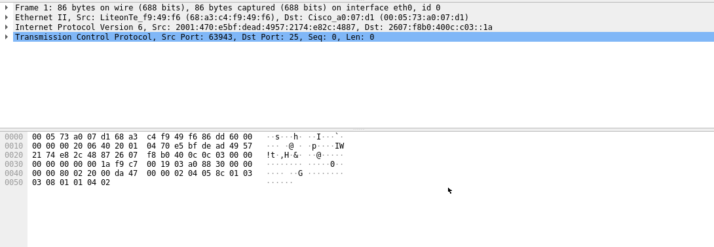

```
0000   00 05 73 a0 07 d1 68 a3 c4 f9 49 f6 86 dd 60 00   ..s...h...I...`.
0010   00 00 00 20 06 40 20 01 04 70 e5 bf de ad 49 57   ... .@ ..p....IW
0020   21 74 e8 2c 48 87 26 07 f8 b0 40 0c 0c 03 00 00   !t.,H.&...@.....
0030   00 00 00 00 00 1a f9 c7 00 19 03 a0 88 30 00 00   .............0..
0040   00 00 80 02 20 00 da 47 00 00 02 04 05 8c 01 03   .... ..G........
0050   03 08 01 01 04 02                                 ......
```
#### **ipk-sniffer**
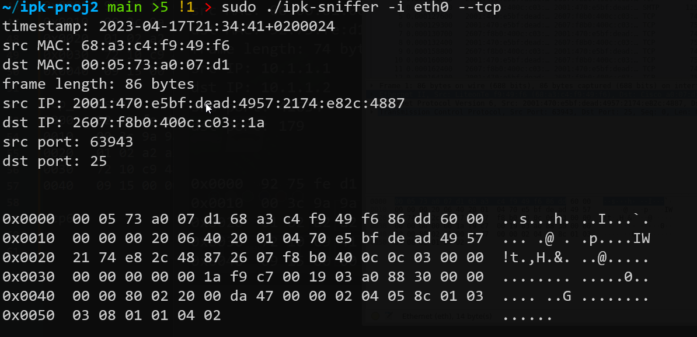

```
0x0000  00 05 73 a0 07 d1 68 a3 c4 f9 49 f6 86 dd 60 00  ..s...h. ..I...`.
0x0010  00 00 00 20 06 40 20 01 04 70 e5 bf de ad 49 57  ... .@ . .p....IW
0x0020  21 74 e8 2c 48 87 26 07 f8 b0 40 0c 0c 03 00 00  !t.,H.&. ..@.....
0x0030  00 00 00 00 00 1a f9 c7 00 19 03 a0 88 30 00 00  ........ .....0..
0x0040  00 00 80 02 20 00 da 47 00 00 02 04 05 8c 01 03  .... ..G ........
0x0050  03 08 01 01 04 02                                ......
```
### **Test 3 - udp IPv4**
#### **wireshark**
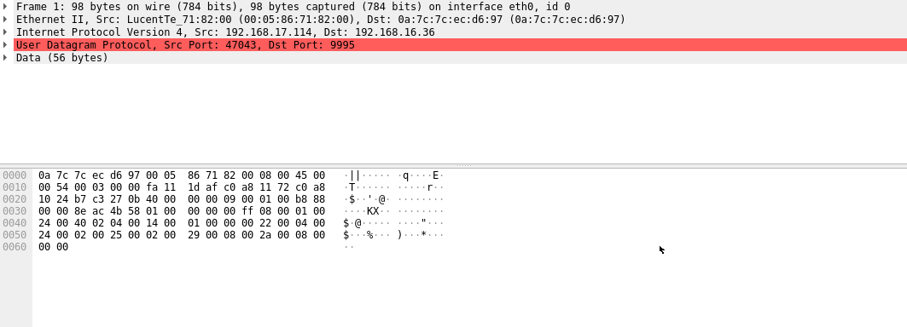

```
0000   0a 7c 7c ec d6 97 00 05 86 71 82 00 08 00 45 00   .||......q....E.
0010   00 54 00 03 00 00 fa 11 1d af c0 a8 11 72 c0 a8   .T...........r..
0020   10 24 b7 c3 27 0b 40 00 00 00 09 00 01 00 b8 88   .$..'.@.........
0030   00 00 8e ac 4b 58 01 00 00 00 00 ff 08 00 01 00   ....KX..........
0040   24 00 40 02 04 00 14 00 01 00 00 00 22 00 04 00   $.@........."...
0050   24 00 02 00 25 00 02 00 29 00 08 00 2a 00 08 00   $...%...)...*...
0060   00 00                                             ..
```
#### **ipk-sniffer**
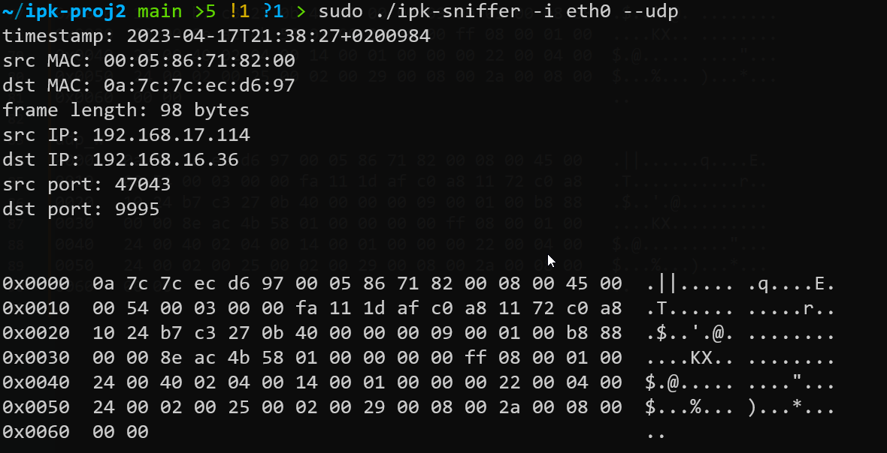

```
0x0000  0a 7c 7c ec d6 97 00 05 86 71 82 00 08 00 45 00  .||..... .q....E.
0x0010  00 54 00 03 00 00 fa 11 1d af c0 a8 11 72 c0 a8  .T...... .....r..
0x0020  10 24 b7 c3 27 0b 40 00 00 00 09 00 01 00 b8 88  .$..'.@. ........
0x0030  00 00 8e ac 4b 58 01 00 00 00 00 ff 08 00 01 00  ....KX.. ........
0x0040  24 00 40 02 04 00 14 00 01 00 00 00 22 00 04 00  $.@..... ...."...
0x0050  24 00 02 00 25 00 02 00 29 00 08 00 2a 00 08 00  $...%... )...*...
0x0060  00 00                                            ..
```
### **Test 4 - udp IPv6**
#### **wireshark**
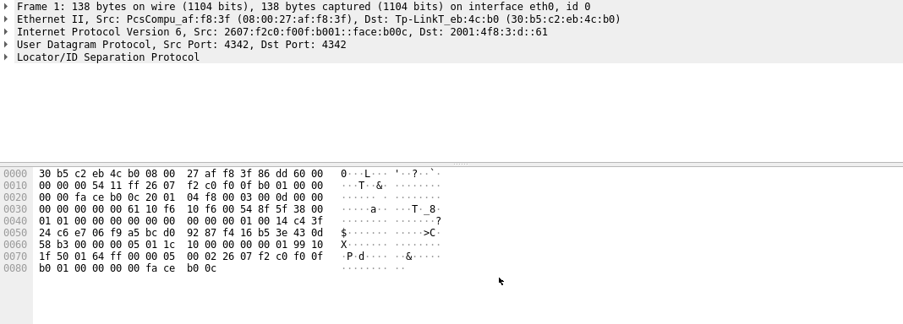

```
0000   30 b5 c2 eb 4c b0 08 00 27 af f8 3f 86 dd 60 00   0...L...'..?..`.
0010   00 00 00 54 11 ff 26 07 f2 c0 f0 0f b0 01 00 00   ...T..&.........
0020   00 00 fa ce b0 0c 20 01 04 f8 00 03 00 0d 00 00   ...... .........
0030   00 00 00 00 00 61 10 f6 10 f6 00 54 8f 5f 38 00   .....a.....T._8.
0040   01 01 00 00 00 00 00 00 00 00 00 01 00 14 c4 3f   ...............?
0050   24 c6 e7 06 f9 a5 bc d0 92 87 f4 16 b5 3e 43 0d   $............>C.
0060   58 b3 00 00 00 05 01 1c 10 00 00 00 00 01 99 10   X...............
0070   1f 50 01 64 ff 00 00 05 00 02 26 07 f2 c0 f0 0f   .P.d......&.....
0080   b0 01 00 00 00 00 fa ce b0 0c                     ..........
```
#### **ipk-sniffer**
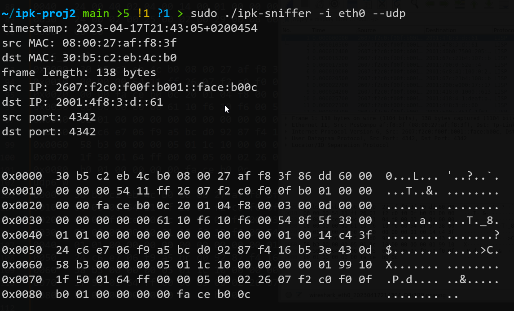

```
0x0000  30 b5 c2 eb 4c b0 08 00 27 af f8 3f 86 dd 60 00  0...L... '..?..`.
0x0010  00 00 00 54 11 ff 26 07 f2 c0 f0 0f b0 01 00 00  ...T..&. ........
0x0020  00 00 fa ce b0 0c 20 01 04 f8 00 03 00 0d 00 00  ...... . ........
0x0030  00 00 00 00 00 61 10 f6 10 f6 00 54 8f 5f 38 00  .....a.. ...T._8.
0x0040  01 01 00 00 00 00 00 00 00 00 00 01 00 14 c4 3f  ........ .......?
0x0050  24 c6 e7 06 f9 a5 bc d0 92 87 f4 16 b5 3e 43 0d  $....... .....>C.
0x0060  58 b3 00 00 00 05 01 1c 10 00 00 00 00 01 99 10  X....... ........
0x0070  1f 50 01 64 ff 00 00 05 00 02 26 07 f2 c0 f0 0f  .P.d.... ..&.....
0x0080  b0 01 00 00 00 00 fa ce b0 0c                    ........ ..
```
### **Test 5 - icmp IPv4**
#### **wireshark**
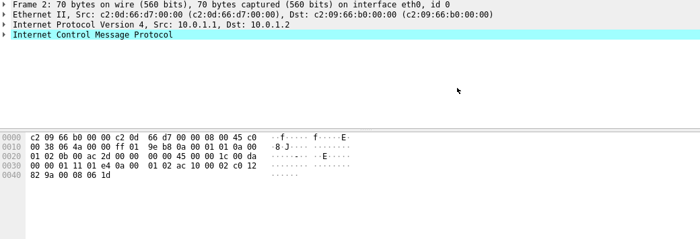

```
0000   c2 09 66 b0 00 00 c2 0d 66 d7 00 00 08 00 45 c0   ..f.....f.....E.
0010   00 38 06 4a 00 00 ff 01 9e b8 0a 00 01 01 0a 00   .8.J............
0020   01 02 0b 00 ac 2d 00 00 00 00 45 00 00 1c 00 da   .....-....E.....
0030   00 00 01 11 01 e4 0a 00 01 02 ac 10 00 02 c0 12   ................
0040   82 9a 00 08 06 1d                                 ......
```
#### **ipk-sniffer**
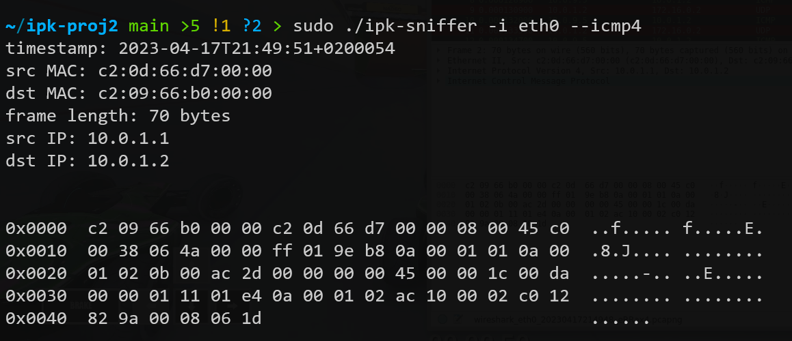

```
0x0000  c2 09 66 b0 00 00 c2 0d 66 d7 00 00 08 00 45 c0  ..f..... f.....E.
0x0010  00 38 06 4a 00 00 ff 01 9e b8 0a 00 01 01 0a 00  .8.J.... ........
0x0020  01 02 0b 00 ac 2d 00 00 00 00 45 00 00 1c 00 da  .....-.. ..E.....
0x0030  00 00 01 11 01 e4 0a 00 01 02 ac 10 00 02 c0 12  ........ ........
0x0040  82 9a 00 08 06 1d                                ......
```
### **Test 6 - icmp IPv6**
#### **wireshark**
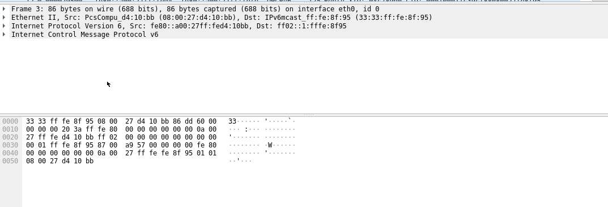
#### **ipk-sniffer**

```
0000   33 33 ff fe 8f 95 08 00 27 d4 10 bb 86 dd 60 00   33......'.....`.
0010   00 00 00 20 3a ff fe 80 00 00 00 00 00 00 0a 00   ... :...........
0020   27 ff fe d4 10 bb ff 02 00 00 00 00 00 00 00 00   '...............
0030   00 01 ff fe 8f 95 87 00 a9 57 00 00 00 00 fe 80   .........W......
0040   00 00 00 00 00 00 0a 00 27 ff fe fe 8f 95 01 01   ........'.......
0050   08 00 27 d4 10 bb                                 ..'...
```
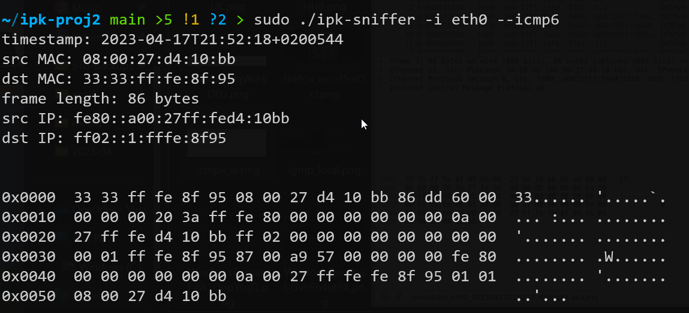

```
0x0000  33 33 ff fe 8f 95 08 00 27 d4 10 bb 86 dd 60 00  33...... '.....`.
0x0010  00 00 00 20 3a ff fe 80 00 00 00 00 00 00 0a 00  ... :... ........
0x0020  27 ff fe d4 10 bb ff 02 00 00 00 00 00 00 00 00  '....... ........
0x0030  00 01 ff fe 8f 95 87 00 a9 57 00 00 00 00 fe 80  ........ .W......
0x0040  00 00 00 00 00 00 0a 00 27 ff fe fe 8f 95 01 01  ........ '.......
0x0050  08 00 27 d4 10 bb                                ..'...
```
### **Test 7 - arp**
#### **wireshark**
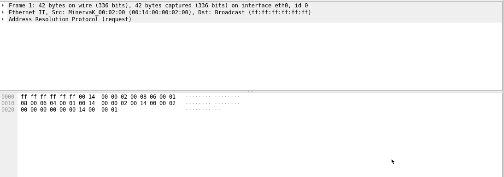
#### **ipk-sniffer**

```
0000   ff ff ff ff ff ff 00 14 00 00 02 00 08 06 00 01   ................
0010   08 00 06 04 00 01 00 14 00 00 02 00 14 00 00 02   ................
0020   00 00 00 00 00 00 14 00 00 01                     ..........
```
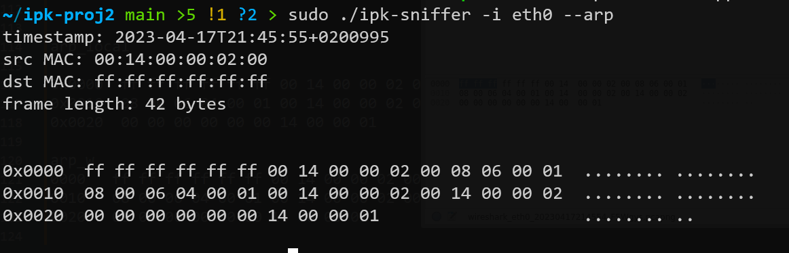

```
0x0000  ff ff ff ff ff ff 00 14 00 00 02 00 08 06 00 01  ........ ........
0x0010  08 00 06 04 00 01 00 14 00 00 02 00 14 00 00 02  ........ ........
0x0020  00 00 00 00 00 00 14 00 00 01                    ........ ..
```
### **Test 8 - igmp**
#### **wireshark**
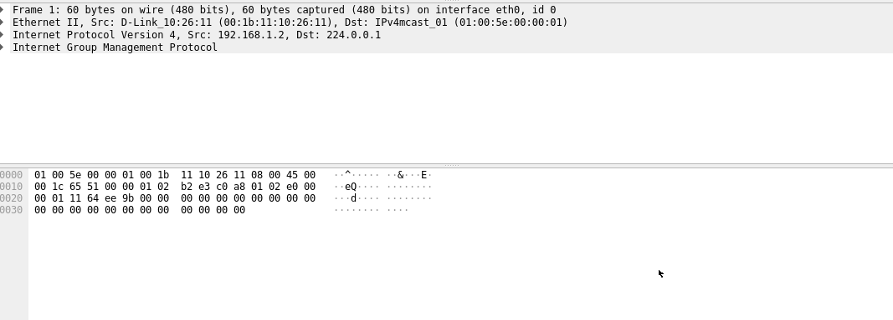

```
0000   01 00 5e 00 00 01 00 1b 11 10 26 11 08 00 45 00   ..^.......&...E.
0010   00 1c 65 51 00 00 01 02 b2 e3 c0 a8 01 02 e0 00   ..eQ............
0020   00 01 11 64 ee 9b 00 00 00 00 00 00 00 00 00 00   ...d............
0030   00 00 00 00 00 00 00 00 00 00 00 00               ............
```
#### **ipk-sniffer**
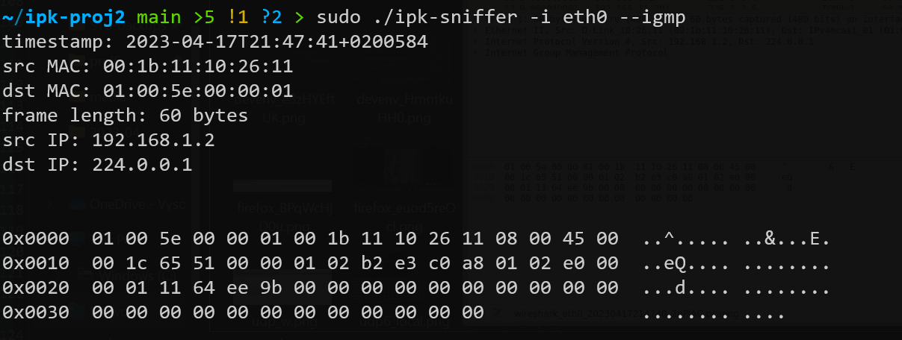

```
0x0000  01 00 5e 00 00 01 00 1b 11 10 26 11 08 00 45 00  ..^..... ..&...E.
0x0010  00 1c 65 51 00 00 01 02 b2 e3 c0 a8 01 02 e0 00  ..eQ.... ........
0x0020  00 01 11 64 ee 9b 00 00 00 00 00 00 00 00 00 00  ...d.... ........
0x0030  00 00 00 00 00 00 00 00 00 00 00 00              ........ ....
```

## **References**
[1] [Wireshark](https://www.wireshark.org/)
    - [online]

[2] [libpcap](https://www.tcpdump.org/)
    - [online]
    - Author: Tim Carstens and Guy Harris

[3] [EtherType](https://en.wikipedia.org/wiki/EtherType)
    - [online]
    - 30 January 2023

[4] [IPv4](https://en.wikipedia.org/wiki/IPv4)
    - [online]
    - 7 April 2023

[5] [Ipv6](https://en.wikipedia.org/wiki/IPv6)
    - [online]
    - 15 April 2023

[6] [Ipv6 Types](https://en.wikipedia.org/wiki/ICMPv6#Types)
    - [online]
    - 13 December 2022


## **License**
This project is licensed under the MPL-2.0 License